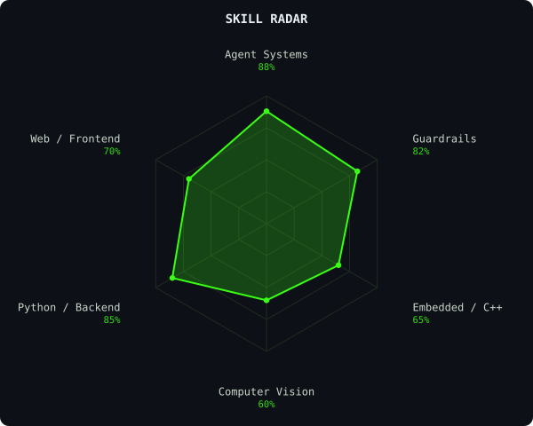
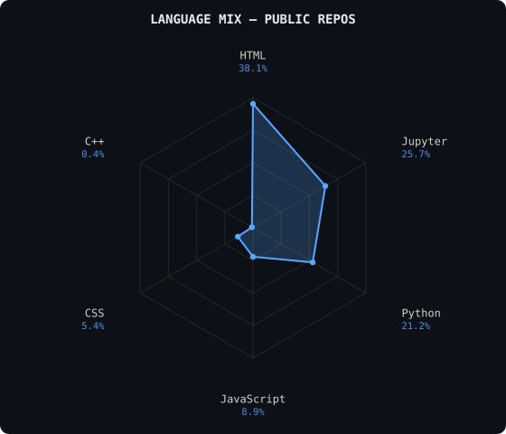
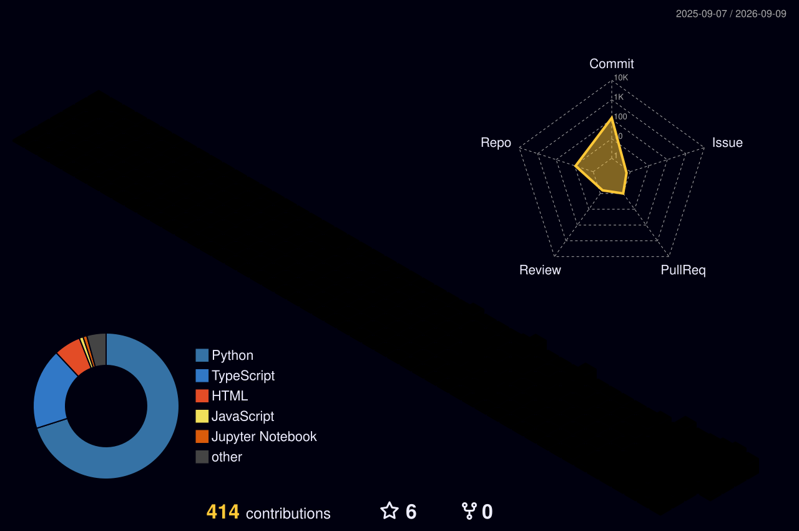

<div align="center">


[](https://www.linkedin.com/in/aranyabandhu/)
[](mailto:aranyabandhu2004@gmail.com)
[](https://aranyabandhu.live)
[](https://x.com/eagleeyebandhu)


</div>

---

### ~/ whoami

```bash
$ cat about.txt

Hi, I'm Aranya Bandhu — an AI Harness & Guardrail Engineer based in Bangalore, IN.

I build agentic AI systems that have to survive production: multi-agent
orchestration, deterministic state-machine control, and inference under
strict latency and reliability constraints.

  > Built Samridh   — an AI-driven combat helmet for the Indian Air Force
  > Built BashIn    — a personal AI system that lives under your cursor
  > Built NeuroSystem — EEG-based target acquisition, <350ms response
  > Built Bharat Farms — satellite-based crop prediction for farmers
  > MoD Research Grant recipient — ₹60L
  > Currently @ Araxys Aerospace

  Portfolio → https://aranyabandhu.live
  (live GitHub-commit orbit globe + real-time status dashboard, built solo)
```

---

### ~/ toolbox

<div align="center">


</div>

---

### ~/ skill radar

<div align="center">
<table><tr>
<td></td>
<td></td>
</tr></table>

<sub>Skill radar is a self-assessment. Language mix is computed live from public repo byte counts — HTML skews high because of one large exported build artifact, not a reflection of actual effort split.</sub>
</div>

---

### ~/ contribution calendar

<div align="center">



</div>

---

<div align="center">
<sub>Building in the open. If it's not shipped, it doesn't count.</sub>
</div>
